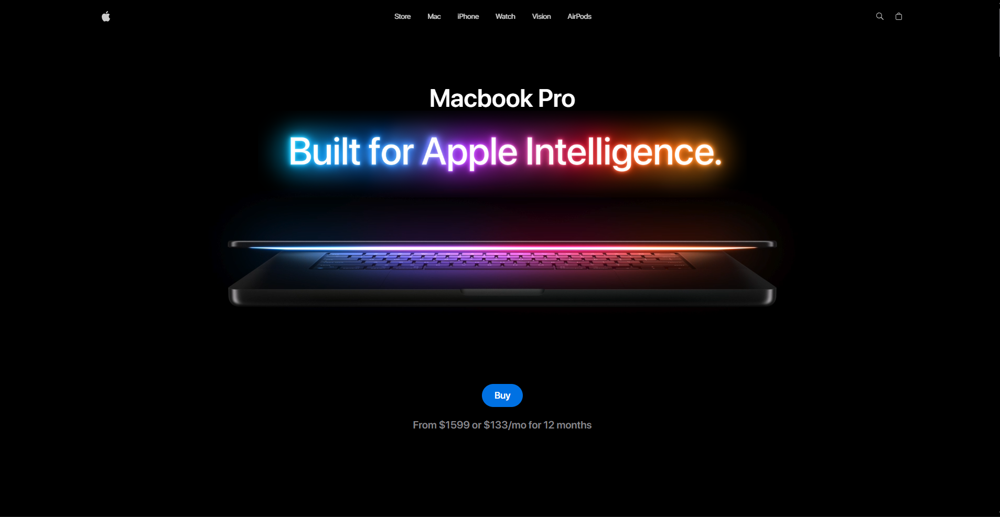

# Apple Mac Experience – 3D Interactive Website  


> **A pixel-perfect, immersive recreation of Apple’s Macbook Pro product experience website** – built from scratch with React Three Fiber, GSAP ScrollTrigger, and advanced 3D animation techniques.

Live Demo → [https://yourusername.github.io/apple-mac-project](https://mac-landing-psi.vercel.app/) 




## Why This Project Exists
This is not just another landing page clone.  
This is a **masterclass in modern frontend craftsmanship** – a full-stack animation experience that pushes the limits of what’s possible in the browser using:
- Scroll-synced 3D model animations
- Cinematic lighting & environment mapping
- Masking reveals, pinned timelines, parallax
- Video scrubbing on scroll
- Butter-smooth 60 FPS performance even on mobile

Built purely to practice and master **GSAP + Three.js + React Three Fiber** at an Apple-level execution.

## Tech Stack & Libraries

| Technology          | Purpose                                                            |
|---------------------|--------------------------------------------------------------------|
| **React 19**        | Component architecture & state management                          |
| **React Three Fiber** | Declarative Three.js in React (Drei helpers heavily used)         |
| **Three.js**        | 3D rendering, GLTF models, custom lighting                         |
| **GSAP + ScrollTrigger** | All scroll animations, timelines, pinning, text splitting     |
| **TailwindCSS**     | Rapid, responsive, and precise styling                             |
| **Vite**            | Blazing-fast dev server & optimized production builds             |
| **Zustand**         | Lightweight global state for model switching & UI controls        |
| **GLTF/DRACO**      | Optimized 3D MacBook models with transformed versions             |

## Key Features

- Immersive 3D hero with real-time studio lighting & reflections
- Scroll-controlled 3D model rotation & zoom (MacBook 14", 16", Air)
- Model switcher with smooth transitions
- 5+ scroll-triggered video sections (play/pause/scrub on scroll)
- Magnetic masked image reveals with pinning
- SplitText typography animations with precise timing
- Performance section with dynamic stat counters & image sequence
- Fully responsive – works flawlessly on mobile & tablet
- Custom animated carousel with gesture support
- Optimized bundle with lazy-loaded models & videos

## Getting Started

### Cloning the Repository

```bash
git clone https://github.com/shreyansh-Geek/Mac-landing.git
cd Mac-landing
```

### Installation

```bash
npm install
```

### Running the Project
```bash
npm run dev
```

Open http://localhost:5173 in your browser to view the project.
